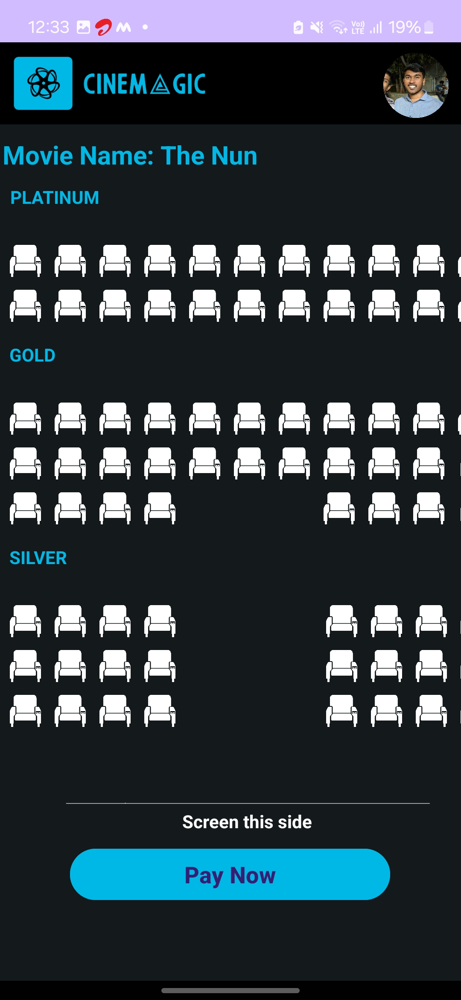

# CineMagic - Your Ultimate Movie Ticket Booking App

CineMagic is an Android application designed to make booking movie tickets a breeze. With a sleek and user-friendly interface, CineMagic provides users with the convenience of browsing through movies, checking showtimes, and booking tickets on the go. Whether you're planning a movie night with friends or a solo cinema experience, CineMagic has got you covered.

## Features

- **Browse Movies**: Explore a wide range of movies, sorted by popularity, release date, or genre.
- **View Details**: Get detailed information about each movie, including synopsis, cast, and ratings.
- **Check Showtimes**: Find out the showtimes for your preferred movies at nearby theaters.
- **Book Tickets**: Easily book tickets for your chosen movie and showtime with just a few taps.
- **Seat Selection**: Select your preferred seats from the available options.
- **Payment Options**: Choose from various payment methods for a seamless booking experience.
- **Ticket Confirmation**: Receive instant confirmation of your booking via email or SMS.
- **User Profiles**: Create and manage your user profile for personalized recommendations and booking history.

## Screenshots

## Technologies Used

- **Android Studio**: The primary IDE for developing the Android application.
- **Java**: The programming language used for implementing the app's logic.
- **Firebase**: Utilized for user authentication, database management, and cloud messaging.
- **Material Design**: Followed Material Design guidelines for a visually appealing and intuitive UI.
- **Third-Party APIs**: Integrated APIs for fetching movie data, showtimes, and seat availability.

## Installation

To run CineMagic on your Android device, follow these steps:

1. Clone this repository to your local machine using `git clone`.
2. Open the project in Android Studio.
3. Connect your Android device to your computer via USB.
4. Build and run the application on your device from Android Studio.

Alternatively, you can also download the APK file from the Releases section and install it directly on your Android device.

## Contributing

Contributions are welcome! If you have any ideas for new features, bug fixes, or improvements, feel free to open an issue or submit a pull request.
